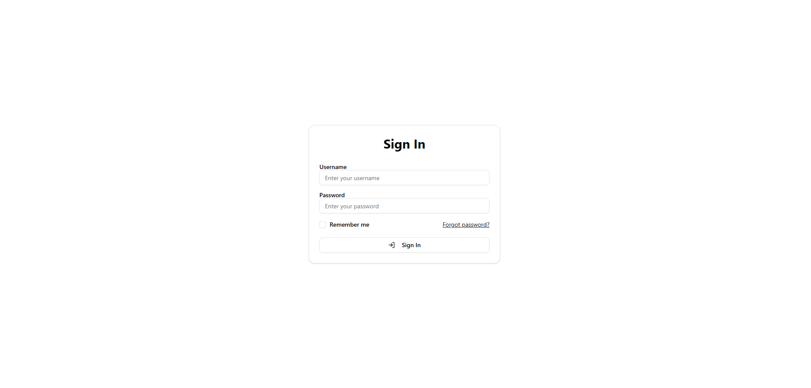
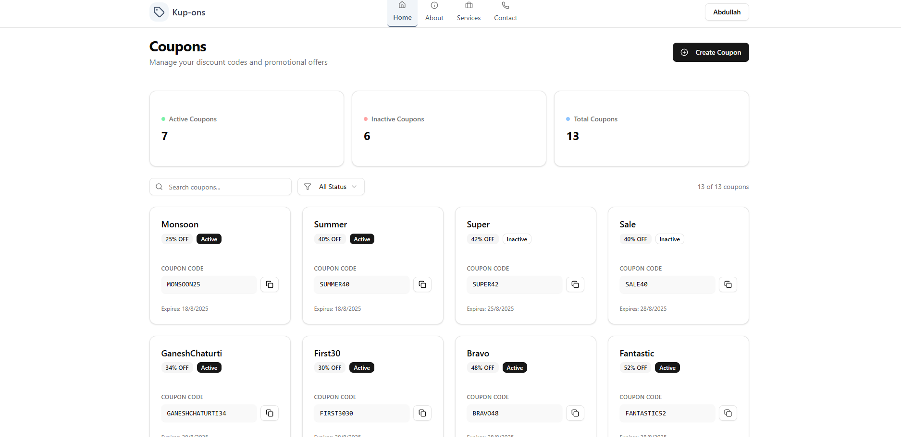
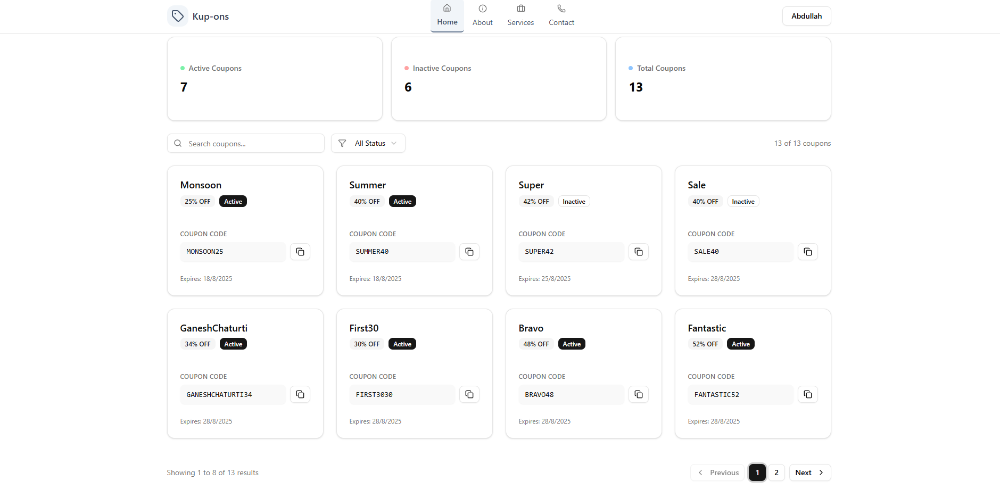
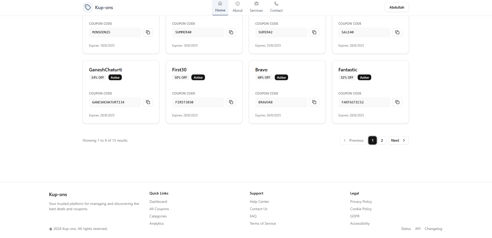
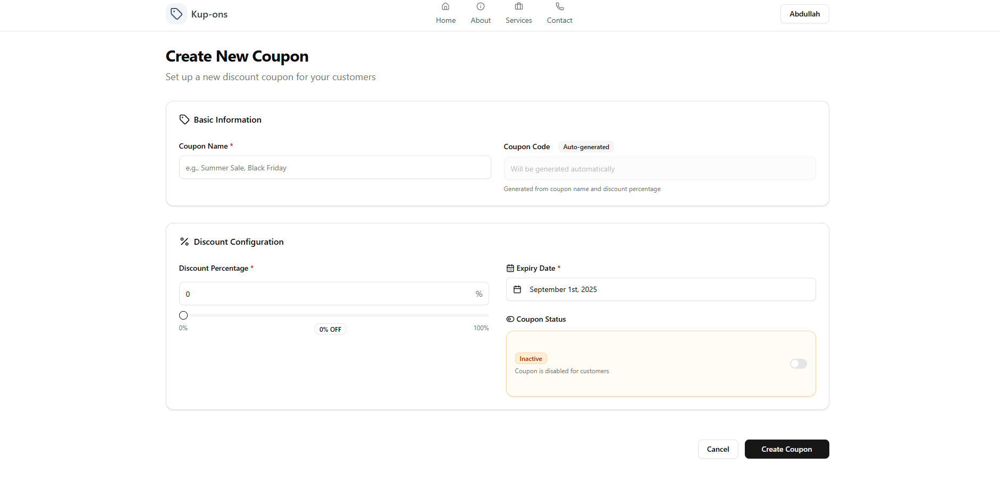
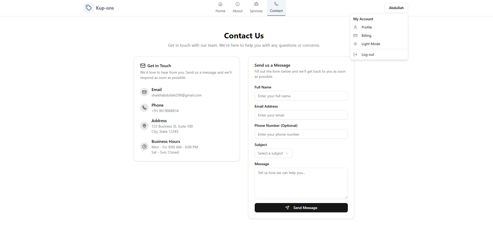

# 🎟️ Coupon Management System

<div align="center">


[](https://github.com/AbdullahShaikh-dotnet/Coupon_Minimal_API-Dotnet-Core/stargazers)
[](https://github.com/AbdullahShaikh-dotnet/Coupon_Minimal_API-Dotnet-Core/network/members)

**A modern, full-stack coupon management solution built with cutting-edge technologies**

[Report Bug](https://github.com/AbdullahShaikh-dotnet/Coupon_Minimal_API-Dotnet-Core/issues) • [Request Feature](https://github.com/AbdullahShaikh-dotnet/Coupon_Minimal_API-Dotnet-Core/issues)

</div>

---

## 🌟 Overview

This **Coupon Management System** showcases modern full-stack development with **.NET 9 Minimal API** powering a robust backend and **React 19** delivering a sleek, responsive frontend experience. Built with clean architecture principles, this project serves as both a functional application and a comprehensive learning resource for developers.

### Why This Project?

- 🏗️ **Modern Architecture** - Demonstrates current best practices in full-stack development
- 🔐 **Enterprise Security** - JWT authentication with role-based authorization
- 📱 **Responsive Design** - Beautiful UI that works seamlessly across all devices
- 🚀 **Production Ready** - Built with scalability and maintainability in mind
- 📚 **Learning Resource** - Well-documented code perfect for educational purposes

---

## ✨ Features

### 🔧 Backend Capabilities
- **🏗️ .NET 9 Minimal API** - Latest framework with improved performance
- **📊 Entity Framework Core** - Efficient data access with SQL Server
- **🎯 Repository Pattern** - Clean separation of concerns
- **🔄 AutoMapper** - Seamless object-to-object mapping
- **✅ FluentValidation** - Robust request validation
- **📋 Swagger/OpenAPI** - Interactive API documentation
- **🔐 JWT Authentication** - Secure token-based authentication
- **👥 Role-based Authorization** - Fine-grained access control
- **📝 Serilog Integration** - Structured, queryable logging
- **⚙️ Configuration Management** - Environment-specific settings

### 🎨 Frontend Experience
- **⚛️ React 19** - Latest React with enhanced performance
- **🎨 Shadcn UI** - Modern, accessible component library
- **📱 Responsive Design** - Mobile-first approach
- **🔐 Secure Authentication** - Integrated JWT handling
- **🎭 Dynamic UI** - Real-time updates and interactions
- **♿ Accessibility** - WCAG compliant components

---

## 🛠️ Technology Stack

<div align="center">

| **Category** | **Technology** | **Purpose** |
|--------------|----------------|-------------|
| 🚀 **Backend** | ASP.NET Core 9 Minimal API | High-performance web API |
| 🗄️ **Database** | SQL Server + Entity Framework Core | Data persistence & ORM |
| 🔒 **Authentication** | JWT + Role-based Auth | Security & access control |
| ✅ **Validation** | FluentValidation | Request validation |
| 🔄 **Mapping** | AutoMapper | Object-to-object mapping |
| 📝 **Logging** | Serilog | Structured logging |
| 📚 **Documentation** | Swagger/OpenAPI | API documentation |
| ⚛️ **Frontend** | React 19 + TypeScript | Modern UI framework |
| 🎨 **UI Components** | Shadcn UI + Tailwind CSS | Beautiful, accessible components |
| 🏗️ **Orchestration** | .NET Aspire | Development orchestration |

</div>

---

## 🚀 Quick Start

### Prerequisites

Ensure you have the following installed on your development machine:

- 📦 [.NET 9 SDK](https://dotnet.microsoft.com/download/dotnet/9.0)
- 🗄️ [SQL Server](https://www.microsoft.com/sql-server/sql-server-downloads) (LocalDB or Express)
- 📝 **IDE**: Visual Studio 2022, JetBrains Rider, or VS Code
- 🟢 [Node.js](https://nodejs.org/) (v18 or later)

### 🔧 Installation

1. **Clone the Repository**
   ```bash
   git clone https://github.com/AbdullahShaikh-dotnet/Coupon_Minimal_API-Dotnet-Core.git
   cd Coupon_Minimal_API-Dotnet-Core
   ```

2. **Setup Database**
   ```bash
   # Navigate to API project directory
   cd CouponAPI
   
   # Apply migrations and create database
   dotnet ef database update
   ```

3. **Install Frontend Dependencies**
   ```bash
   # Navigate to UI project directory
   cd ../Coupon-UI
   
   # Install npm packages
   npm install
   ```

4. **Configure Application**
   
   Update `appsettings.json` with your configurations:
   ```json
   {
     "ConnectionStrings": {
       "DefaultConnection": "YourSqlServerConnectionString"
     },
     "JwtSettings": {
       "Secret": "YourJwtSecret",
       "Issuer": "YourIssuer",
       "Audience": "YourAudience"
     },
     "AutoMapper": {
       "LicenseKey": "YourAutoMapperLicenseKey"
     }
   }
   ```

### 🚀 Running the Application

#### Option 1: With .NET Aspire (Recommended)
```bash
npm run dev:aspire
```

#### Option 2: Manual Start
```bash
npm run dev:all
```

#### Option 3: Individual Services
```bash
# Terminal 1 - API
cd CouponAPI
dotnet run

# Terminal 2 - UI
cd Coupon-UI
npm start
```

---

## 📸 Application Preview

<div align="center">

### 🔐 Authentication


### 🏠 Dashboard
<table>
  <tr>
    <td></td>
    <td></td>
  </tr>
  <tr>
    <td colspan="2"></td>
  </tr>
</table>

### ⚙️ Management
<table>
  <tr>
    <td></td>
    <td></td>
  </tr>
</table>

</div>

---

## 🏗️ Project Architecture

```
📁 Coupon_Minimal_API-Dotnet-Core/
├── 🔧 CouponAPI/                    # .NET 9 Minimal API Backend
│   ├── 📋 Endpoints/                # API endpoints
│   ├── 🗄️ Data/                     # DbContext
│   ├── 🐫 Migration/                # migrations
│   ├── 📦 Models/                   # Domain models
│       ├── 🔄 DTOs/                # Data transfer objects
│   ├── 🛡️ Repository/               # Database CRUD Logic
│   ├── ✅ Validators/               # FluentValidation rules
│   ├── 🔧 Utilities/                # Rate Limiter
│   └── 📝 Program.cs                # Application entry point
├── ⚛️ Coupon-UI/                    # React 19 Frontend
│   ├── 📁 src/
│   │   ├── 🧩 components/           # Application UI components
│   │       ├── 🧩 ui/               # Shadcn Reuseable UI components
│   │   ├── 🖼️ assets/               # Graphics
│   │   └── 🛠️ utility/              # Helper functions and Global Reuseable Components
│   └── 📦 package.json
├── 🌐 Aspire.AppHost/               # .NET Aspire orchestration
└── 📖 README.md
```

---

## 📋 API Endpoints

### 🎟️ Coupon Management
```http
GET    /api/coupons              # Get all coupons
GET    /api/coupons/{id}         # Get coupon by ID
POST   /api/coupons              # Create new coupon
PUT    /api/coupons/{id}         # Update coupon
DELETE /api/coupons/{id}         # Delete coupon
```

### 🔐 Authentication
```http
POST   /api/auth/login           # User login
POST   /api/auth/register        # User registration
POST   /api/auth/refresh         # Refresh JWT token
```

---

## 🔧 Configuration

### Database Connection
Update your `appsettings.json`:
```json
{
  "ConnectionStrings": {
    "DefaultConnection": "Server=(localdb)\\mssqllocaldb;Database=CouponDB;Trusted_Connection=true;MultipleActiveResultSets=true"
  }
}
```

### JWT Settings
```json
{
  "JwtSettings": {
    "Secret": "your-super-secret-key-here-make-it-long-and-secure",
    "Issuer": "CouponAPI",
    "Audience": "CouponApp",
    "ExpirationInHours": 24
  }
}
```

---

## 🧪 Testing

### Backend Testing
```bash
cd CouponAPI
dotnet test
```

### Frontend Testing
```bash
cd Coupon-UI
npm test
```

---

<!-- ## 📦 Deployment

### Docker Support
```dockerfile
# Build and run with Docker
docker build -t coupon-api .
docker run -p 8080:80 coupon-api
```

### Azure Deployment
The application is ready for deployment to:
- **Azure App Service** (Backend API)
- **Azure Static Web Apps** (Frontend)
- **Azure SQL Database** (Database)

--- -->

## 🤝 Contributing

We welcome contributions! Here's how you can help:

1. **Fork the Project**
2. **Create Feature Branch** (`git checkout -b feature/AmazingFeature`)
3. **Commit Changes** (`git commit -m 'Add some AmazingFeature'`)
4. **Push to Branch** (`git push origin feature/AmazingFeature`)
5. **Open Pull Request**

### Development Guidelines
- Follow existing code style and conventions
- Write clear, descriptive commit messages
- Include tests for new features
- Update documentation as needed

---

## 📝 License

This project is licensed under the **MIT License** - see the [LICENSE](LICENSE) file for details.

---

## 🙏 Acknowledgments

- **Microsoft** - for the amazing .NET ecosystem
- **React Team** - for the powerful React framework
- **Shadcn** - for the beautiful UI components
- **Community** - for continuous inspiration and feedback

---

## 📞 Contact & Support

<div align="center">

**Abdullah Shaikh**

[](https://github.com/AbdullahShaikh-dotnet)
[](https://www.linkedin.com/in/abdullahshaikh-dotnet?utm_source=share&utm_campaign=share_via&utm_content=profile&utm_medium=android_app)
[](mailto:shaikhabdullah299@gmail.com)

---

### 💡 Found this helpful? Give it a ⭐

**If you found this project useful, please consider giving it a star. It helps others discover the project and motivates continued development!**

[](https://github.com/AbdullahShaikh-dotnet/Coupon_Minimal_API-Dotnet-Core/stargazers)

</div>

---

## 🚦 Project Status

| Aspect | Status |
|--------|--------|
| 🏗️ **Development** | ✅ Active |
| 🧪 **Testing** | ✅ Comprehensive |
| 📖 **Documentation** | ✅ Complete |
| 🐛 **Bug Reports** | ✅ Welcome |
| 🚀 **Feature Requests** | ✅ Open |

---

<div align="center">

**Built with ❤️ and lots of ☕**

*Made possible by the amazing open-source community*

</div>
